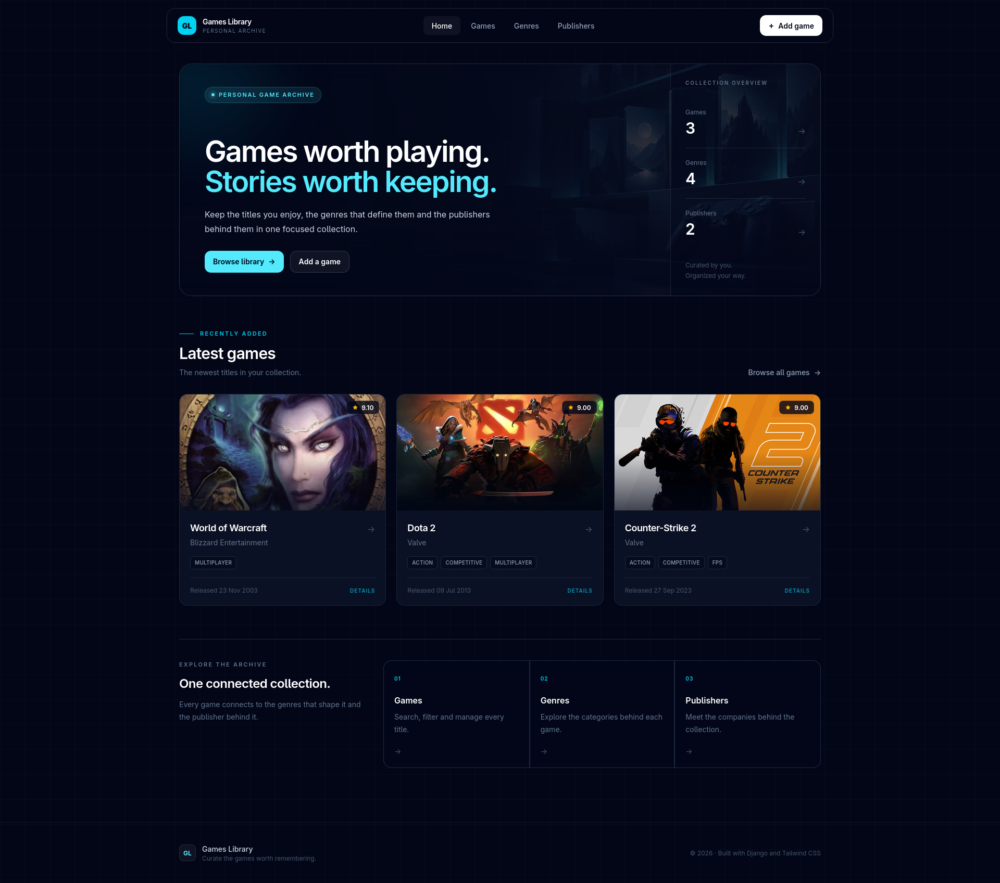
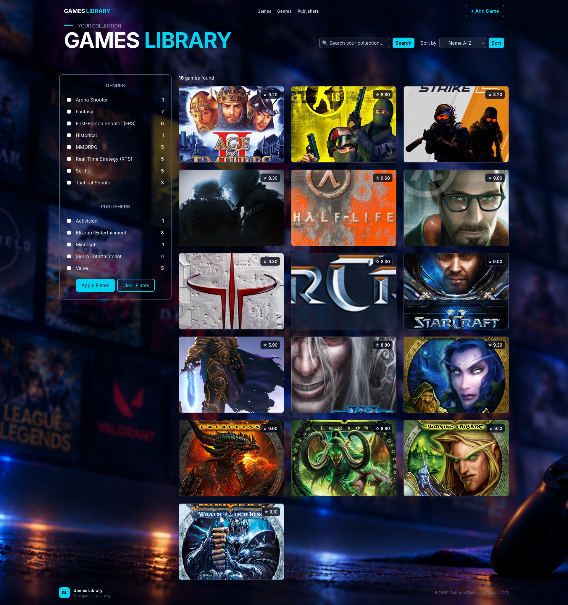
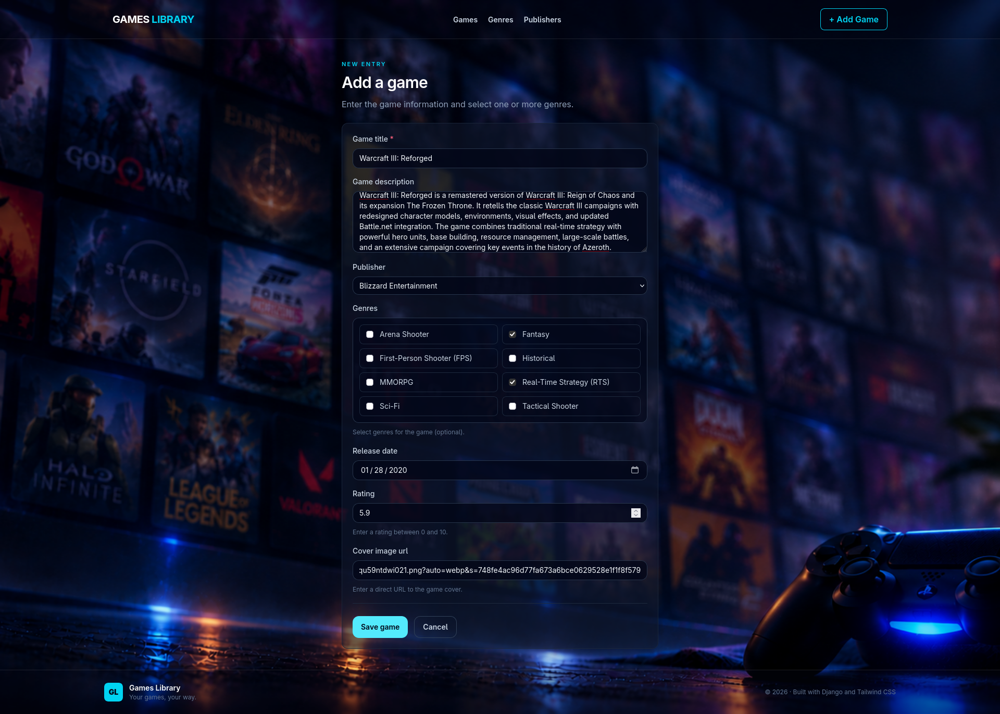
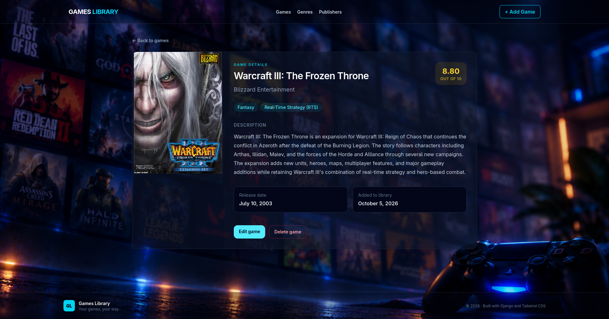
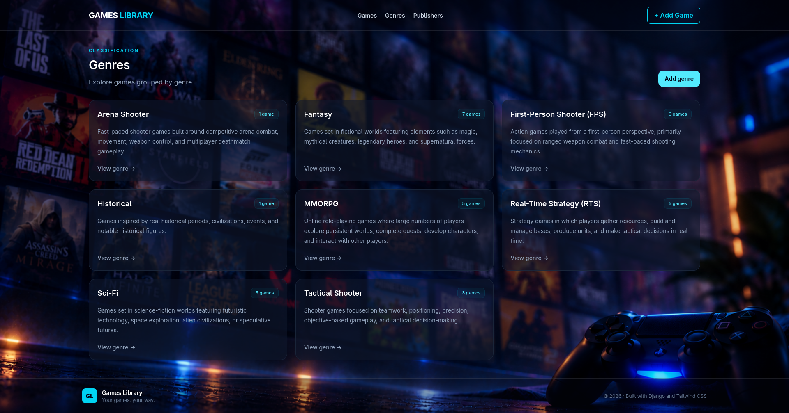
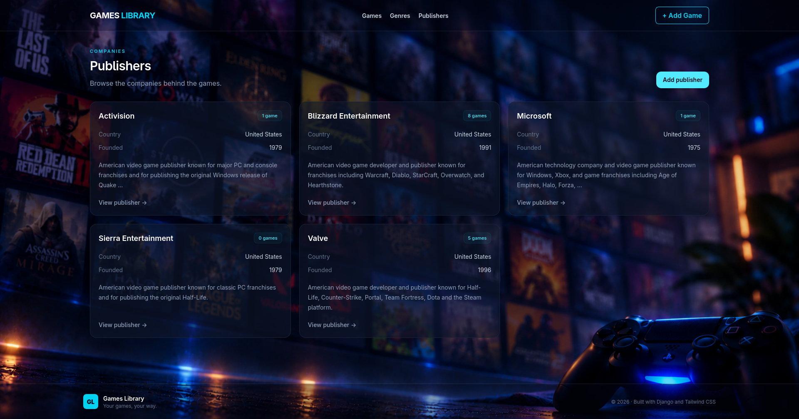

<div align="center">

# 🎮 Games Library

### Django application for managing a personal video game collection

**Django 6.1.1 · PostgreSQL · Tailwind CSS 4 · Django Templates**

</div>

---

<p align="center">
  
</p>

## About

**Games Library** is a Django web application for creating and managing a personal collection of video games.

Games can include a description, publisher, genres, release date, rating, and cover image. Publishers and genres are optional, allowing games to be created independently.

The interface is responsive and uses a dark gaming-inspired design built with Tailwind CSS.

## Features

- CRUD operations for games, genres, and publishers
- Search games by name or description
- Filter by genre and publisher
- Sort by name, rating, and release date
- Optional publisher and genres
- Rating validation from `0` to `10`
- Publisher deletion protection with `PROTECT`
- Responsive interface
- Custom `404` and `500` pages
- Django Admin with Django Unfold

## Preview

| Games | Add Game |
| --- | --- |
|  |  |

| Game-details |
| --- | --- |
|  |

| Genres | Publishers |
| --- | --- |
|  |  |

## Data Model

The project contains three main models:

- **Game** — name, description, publisher, genres, release date, rating, and cover URL
- **Genre** — reusable genre information connected to multiple games
- **Publisher** — country, founding year, website, and related games

Shared fields such as `name`, `description`, `created_at`, and `updated_at` are provided through an abstract `CommonModel`.

```text
Publisher  1 ──────── *  Game
                optional FK

Genre      * ──────── *  Game
                optional M2M
```

## Technologies

| Area | Technology |
| --- | --- |
| Backend | Python 3.14, Django 6.1.1 |
| Database | PostgreSQL |
| Frontend | Django Templates |
| Styling | Tailwind CSS 4 |
| Admin | Django Admin + Django Unfold |
| Environment | python-dotenv |
| Code quality | Ruff |

## Local Setup

### 1. Clone the repository

```bash
git clone https://github.com/valeri-ngo/games_library.git
cd games_library
```

### 2. Create and activate a virtual environment

```bash
python -m venv .venv
source .venv/bin/activate
```

### 3. Install dependencies

```bash
pip install -r requirements.txt
npm install
```

### 4. Configure environment variables

Create a `.env` file:

```env
SECRET_KEY=your-secret-key

DB_NAME=games_library
DB_USER=postgres
DB_PASS=your-password
DB_HOST=localhost
DB_PORT=5432
```

### 5. Apply migrations

```bash
python manage.py migrate
```

### 6. Build Tailwind CSS

```bash
npm run build:css
```

For development:

```bash
npm run dev:css
```

### 7. Start the server

```bash
python manage.py runserver
```

Open:

```text
http://127.0.0.1:8000/
```

## Django Admin

Create an administrator:

```bash
python manage.py createsuperuser
```

Then open:

```text
http://127.0.0.1:8000/admin/
```

---

<div align="center">

### Built with Django, PostgreSQL and Tailwind CSS

</div>