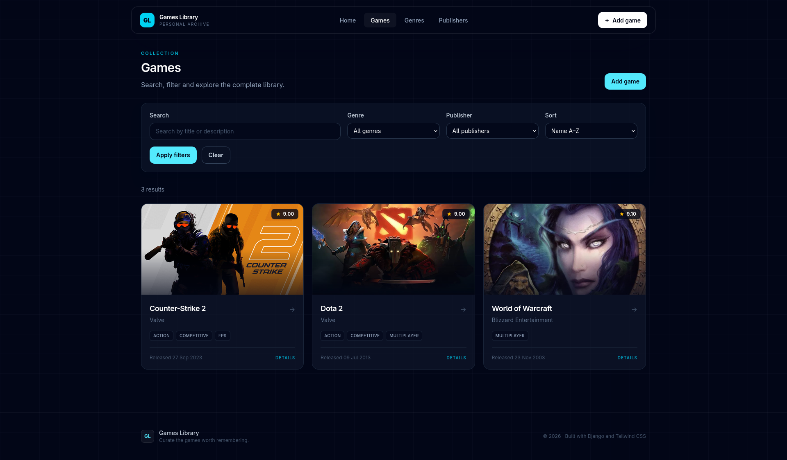
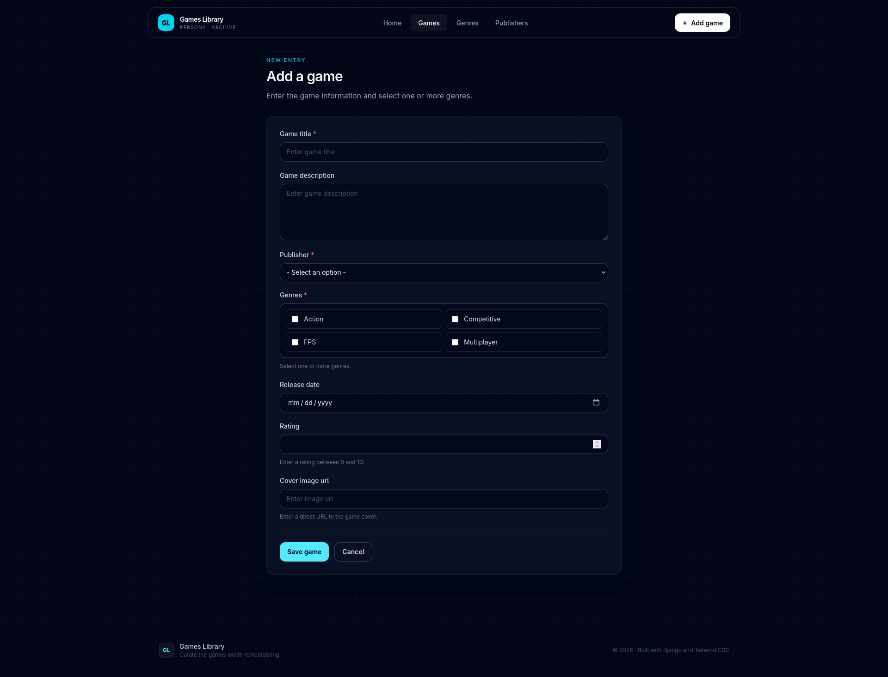
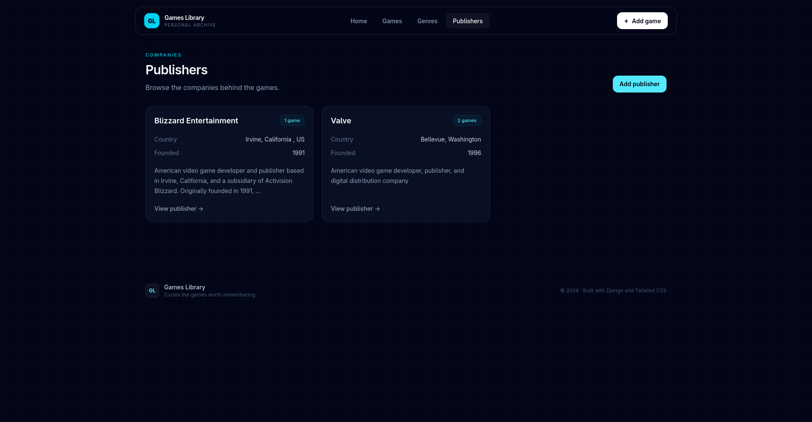

# Games Library

<p align="center">
  
</p>

## Български

**Games Library** е Django уеб приложение за създаване и управление на лична колекция от игри.

Работният процес е прост:

**Жанрове → Издатели → Игри → Търсене / Филтриране / Сортиране**

Първо се създават жанровете и издателите, а след това игрите се свързват с тях. За всяка игра могат да се добавят описание, дата на издаване, рейтинг и URL към изображение.

### Основни възможности

- CRUD операции за игри, жанрове и издатели
- търсене на игри по име и описание
- филтриране по жанр и издател
- сортиране по име, рейтинг и дата на издаване
- детайлни страници за всички основни обекти
- custom 404 и 500 страници
- responsive интерфейс с Tailwind CSS
- PostgreSQL база данни

## Преглед

| Игри | Добавяне на игра |
| --- | --- |
|  |  |

| Жанрове | Издатели |
| --- | --- |
|  |  |

---

## English

**Games Library** is a Django web application for creating and managing a personal game collection.

The workflow is:

**Genres → Publishers → Games → Search / Filter / Sort**

Genres and publishers are created first, then games are connected to them and can include a description, release date, rating and cover image URL.

### Main features

- CRUD for games, genres and publishers
- search, filtering and sorting
- detail pages for all main entities
- custom 404 and 500 pages
- responsive Tailwind CSS interface
- PostgreSQL database

## Technologies

**Python · Django · PostgreSQL · Tailwind CSS · Django Templates**

## Local setup

```bash
python -m venv .venv
source .venv/bin/activate
pip install -r requirements.txt
npm install
```

Create a `.env` file:

```env
SECRET_KEY=your-secret-key
DEBUG=True
ALLOWED_HOSTS=127.0.0.1,localhost

DB_NAME=your-database
DB_USER=your-user
DB_PASS=your-password
DB_HOST=localhost
DB_PORT=5432
```

Then run:

```bash
python manage.py migrate
npm run build:css
python manage.py runserver
```